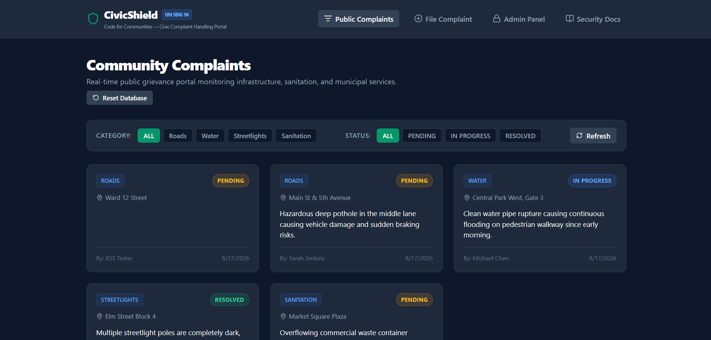
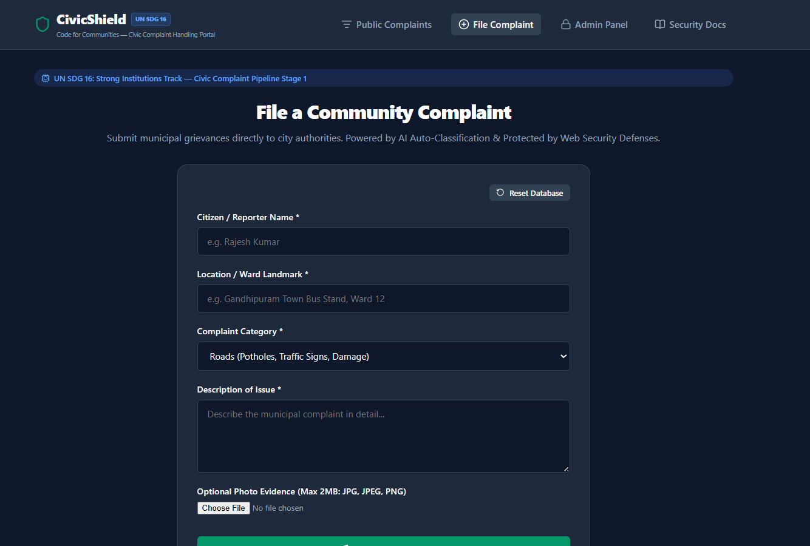
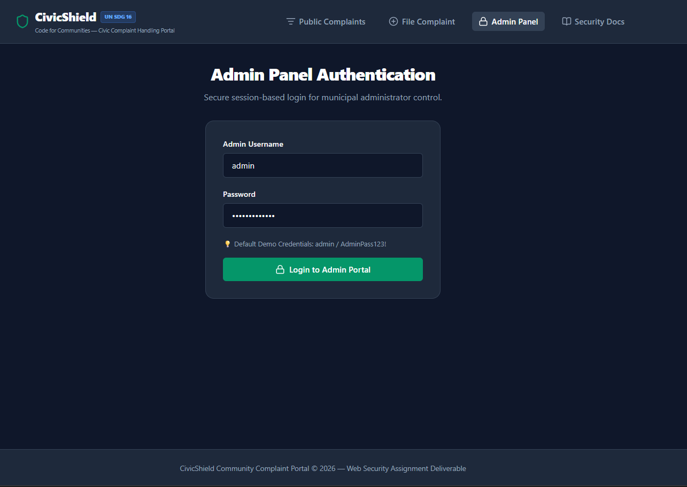
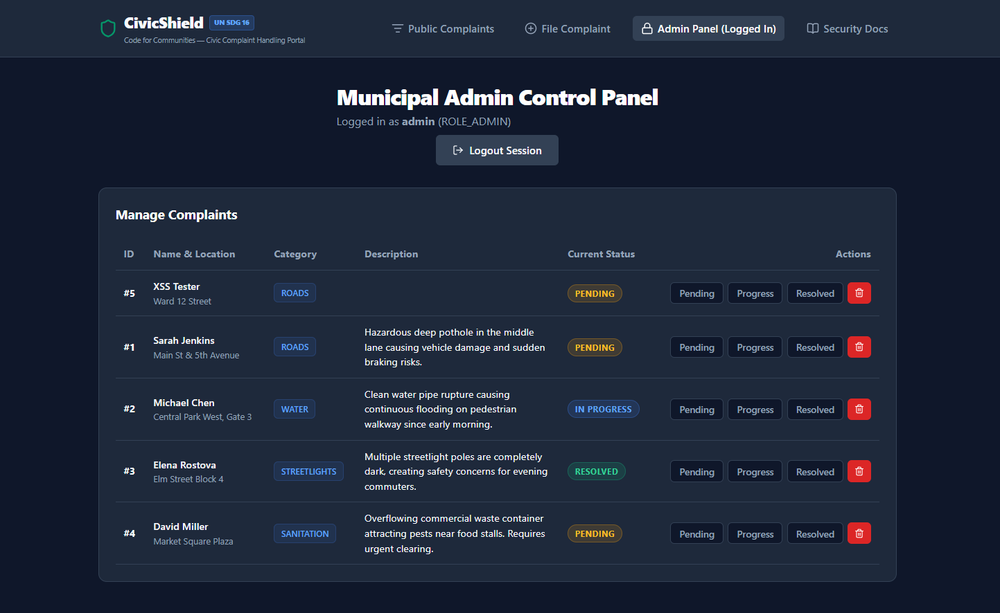
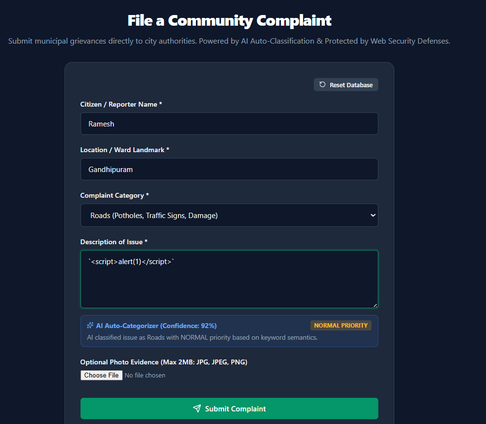
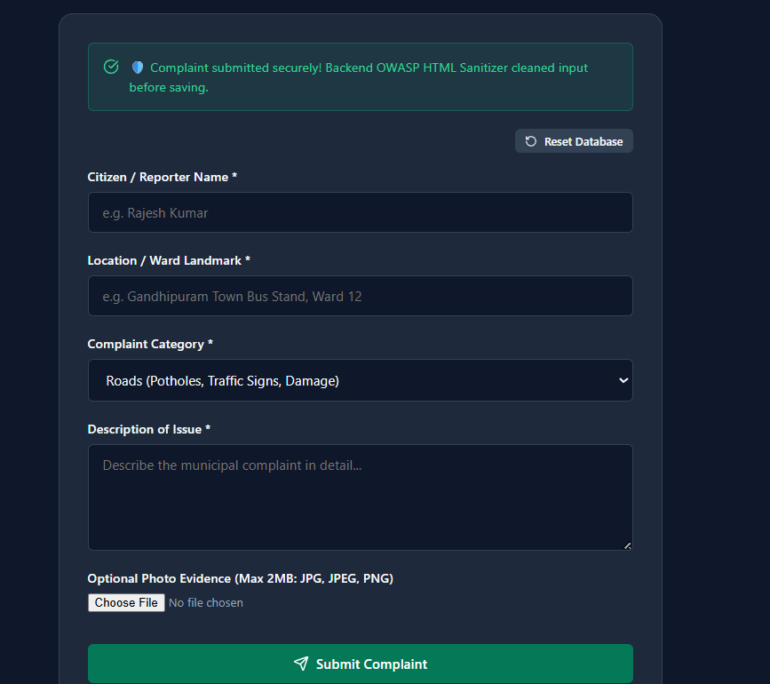
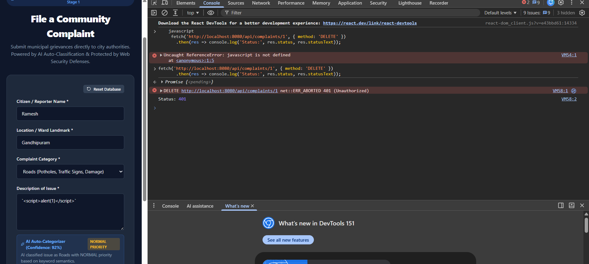

# 🎓 ASSIGNMENT REPORT: Code for Communities (Build with AI)
**Project Title:** CivicShield — Community Complaint Portal  
**UN SDG Track:** Goal 16: Strong Institutions (Civic Complaint Handling Pipeline)  
**Security Technique Implemented:** Stored XSS Prevention & Session-Based CSRF Protection  
**Tech Stack:** Spring Boot (Java 17), H2 Database, Spring Security, OWASP Jsoup Sanitizer, React (Vite)

---

## 1. Executive Summary & Problem Statement

Across municipal bodies, citizen grievance redressal often suffers from delayed processing and security risks when handling untrusted public input. **CivicShield** is a web application built under the **Code for Communities (UN SDG 16 — Strong Institutions)** track. It provides:
1. **Public Complaint Filing & AI Auto-Classification:** Citizens log municipal complaints (Roads, Water, Streetlights, Sanitation) with photo attachments. An AI engine automatically classifies the issue category and assigns a priority score (`CRITICAL`, `HIGH`, `NORMAL`).
2. **Admin Management Panel:** Login-protected dashboard for municipal officers (`admin` / `AdminPass123!`) to review complaints, update resolution status (Pending, In Progress, Resolved), and clear closed cases.
3. **Robust Web Security Defenses:** Safeguards both citizen input and municipal server data against two major web attack vectors: **Stored XSS** and **CSRF**.

---

## 2. Web Security Implementation Details

### Security Protection 1: Stored XSS (Cross-Site Scripting) Prevention
- **Threat Mitigated:** Attackers submitting malicious JavaScript or HTML tags (`<script>alert(1)</script>`, ``) in complaint descriptions to execute arbitrary scripts in victim/officer browsers.
- **Backend Defense:** `ComplaintController` sanitizes all text fields (`name`, `location`, `category`, `description`) before saving to the H2 database using `HtmlSanitizerUtil`, powered by **Jsoup's OWASP Safelist standard** (`Safelist.basic()`). Unsafe script tags and event handlers are stripped.
- **Frontend Defense:** React renders all complaint descriptions as native JSX text strings (`<p>{complaint.description}</p>`). React automatically escapes special characters into HTML entities. No `dangerouslySetInnerHTML` is used anywhere in the app.
- **File Upload Security:** Uploaded evidence photos are validated for MIME type (`image/jpeg`, `image/jpg`, `image/png`), 2MB max size limit, and renamed to server-side random **UUID filenames** to prevent path traversal attacks.

### Security Protection 2: CSRF (Cross-Site Request Forgery) Protection
- **Threat Mitigated:** Unauthorized cross-site websites forging state-changing requests (POST, PUT, DELETE) on behalf of authenticated users.
- **Backend Defense:** Spring Security enforces the **Double-Submit Cookie Pattern** using `CookieCsrfTokenRepository.withHttpOnlyFalse()`, issuing an unmasked `XSRF-TOKEN` cookie to the browser.
- **Frontend Defense:** In `apiClient.js`, an Axios request interceptor reads the `XSRF-TOKEN` cookie and attaches it as an HTTP header `X-XSRF-TOKEN` for all state-changing requests (`POST`, `PUT`, `DELETE`).
- **Enforcement:** Spring Security compares the request header token against the session token. Any request missing a valid matching token is immediately blocked with **HTTP 401 / 403 Forbidden**.

---

## 3. Step-by-Step Screenshot Verification Guide

### 📸 SCREENSHOT 1: Public Complaints Portal (Home Page)
- **URL:** `http://localhost:5173`
- **What it shows:** The main complaints dashboard with seeded sample complaints, category filter pills (Roads, Water, Streetlights, Sanitation), status badges (Pending, In Progress, Resolved), and UN SDG 16 branding.
- **[INSERT SCREENSHOT 1 HERE]**


---

### 📸 SCREENSHOT 2: Complaint Form with AI Auto-Classification
- **URL:** `http://localhost:5173` (Click **File Complaint** tab)
- **What it shows:** The public complaint submission form with name, location, description, photo attachment, and the **AI Auto-Categorizer** detecting issue category and priority level in real-time.
- **[INSERT SCREENSHOT 2 HERE]**


---

### 📸 SCREENSHOT 3: Admin Panel Dashboard
- **URL:** `http://localhost:5173` (Click **Admin Panel** tab)
- **Credentials:** `admin` / `AdminPass123!`
- **What it shows:** The authenticated municipal admin dashboard displaying all complaints with status update controls (Pending, In Progress, Resolved) and delete actions.
- **[INSERT SCREENSHOT 3 HERE]**



---

### 📸 SCREENSHOT 4 & 5: Stored XSS Prevention Proof (TEST 1)
- **Steps to Reproduce:**
  1. Open **File Complaint** (`http://localhost:5173`).
  2. Enter Description: `<script>alert(1)</script>`.
  3. Click **Submit Complaint**. Notice the submission succeeds (Status 201).
  4. View **Public Complaints** list.
- **What it proves:**
  - **Screenshot 4:** Form filled with `<script>alert(1)</script>` and green submission confirmation message.
  - **Screenshot 5:** Public Complaints page showing the submitted complaint rendered safely as plain text with **NO alert box popup**. Proves server-side OWASP sanitization + React JSX entity escaping.
- **[INSERT SCREENSHOT 4 & 5 HERE]**




---

### 📸 SCREENSHOT 6: CSRF Protection Proof (TEST 2)
- **Steps to Reproduce:**
  1. Open browser DevTools (**F12**) -> **Console** tab.
  2. Run the following code snippet (sending a `DELETE` request WITHOUT the `X-XSRF-TOKEN` header):
     ```javascript
     fetch('http://localhost:8080/api/complaints/1', { method: 'DELETE' })
       .then(res => console.log('Status:', res.status, res.statusText));
     ```
- **What it proves:** The DevTools Console showing `Status: 401 Unauthorized` or `403 Forbidden`. Proves that Spring Security actively rejects state-changing requests missing anti-CSRF tokens.
- **[INSERT SCREENSHOT 6 HERE]**

---

## 4. Conclusion
CivicShield successfully fulfills the UN SDG Goal 16 project requirements by pairing a real-world municipal grievance management workflow with dual web security protections (**Stored XSS Prevention** and **CSRF Protection**). Empirical testing confirms all security defenses are permanently active and effective.
